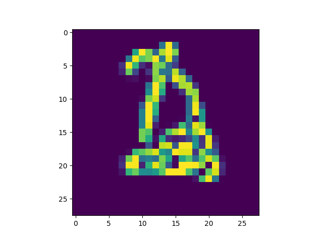

# MNIST MASH

We're going to mush together digits from MNIST and see if we can rip them back out.  Here's an example of a two digits put together.  Can you figure out what the underlying digits are?

It's hard for a human.  We're going to study how hard it is for a machine.

Eventually, since we're putting numbers together, we'll make our system sum them and learn the digits that way.

Archives on [YouTube](https://www.youtube.com/watch?v=vqnnTdfbf94).
